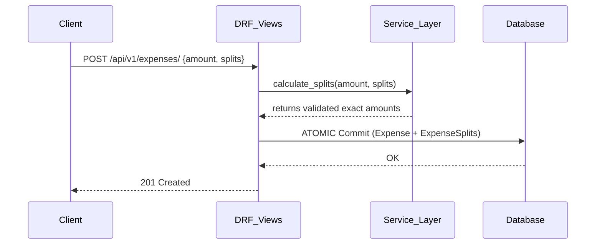
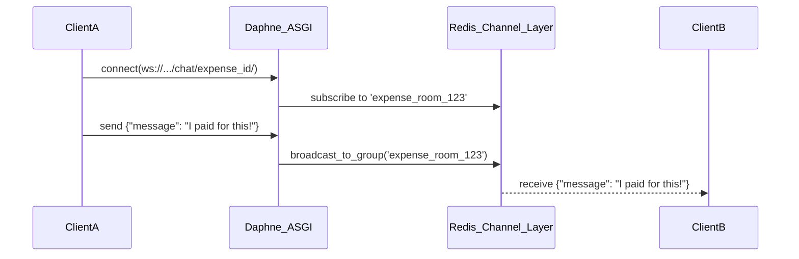

# The Living System Document (AI Context)

**Purpose:** This document is the absolute single source of truth for AI agents (and human developers) onboarding onto the Splitwise Clone. It contains the product vision, domain terminology, structural architecture, and current implementation status. 

> [!IMPORTANT]
> **AI Agents:** You MUST read this document entirely before writing any code or proposing architectural changes.

---

## 1. Product Vision & Business Objectives

### 1.1 Product Vision
To build the most intuitive, transparent, and frictionless shared-expense ledger on the web. The application guarantees mathematical certainty in peer-to-peer debts, eliminating the social awkwardness of asking friends for money.

### 1.2 Core Problems Being Solved
- **The "Who Owes Who" Matrix:** Tracking nested debts across multiple people (e.g., Alice paid for Bob, but Bob paid for Charlie).
- **Transparency:** Debts must be auditable down to the exact decimal, with persistent chat histories for dispute resolution.
- **Data Ingestion Friction:** Users shouldn't have to manually type 50 expenses from a multi-day trip; they need robust bulk CSV ingestion.

### 1.3 User Personas
- **The Organizer (Alice):** Creates groups, invites members, and does the heavy lifting of importing CSVs from the bank.
- **The Participant (Bob):** Logs in to check balances, chats in expense rooms to clarify details, and logs settlements.

---

## 2. Domain Terminology

- **Expense:** A single financial transaction paid by one person, split among `N` participants.
- **Split Strategy:** The mathematical distribution logic:
  - `EQUAL`: Split evenly among participants.
  - `EXACT`: Specified exact currency amounts per participant.
  - `PERCENTAGE`: Specified percentages summing to exactly 100%.
  - `SHARES`: Fractional shares relative to total shares.
- **Settlement:** A recorded repayment from a Debtor to a Creditor, reducing their owed balance.
- **Balance:** The net calculated amount a user owes or is owed. Positive = Owed to you. Negative = You owe.
- **Zero-Sum Invariant:** The foundational rule that the sum of all splits must exactly equal the total expense amount.
- **Staged Expense:** A parsed CSV row awaiting human confirmation before being permanently committed to the ledger.

---

## 3. Current System Architecture

The application is decoupled into a Django REST/ASGI backend and a React 18 SPA frontend.

### 3.1 Backend (Django)
- **Framework:** Django 4.2 + DRF 3.14
- **Real-Time:** Django Channels 4.x + Daphne (ASGI) + Redis (or InMemory locally).
- **Database:** PostgreSQL (Production) / SQLite (Local).
- **Service Layer Abstraction:** All core business logic lives in `/services/` (e.g., `services/splitting.py`, `services/validator.py`, `services/balances.py`). This guarantees atomic transactions and protects the zero-sum invariant.

### 3.2 Frontend (React)
- **Framework:** React 18 + Vite 5
- **Styling:** Tailwind CSS (Glassmorphism design, dark mode aesthetics).
- **State:** React Context API + Custom Hooks. Complex data flows (like the Importer) are managed via localized state machines (`useImport.js`).
- **Real-Time:** Native WebSockets bound to component mounting/unmounting.

---

## 4. Data Flow & Integration Points

### 4.1 REST API Flow (Standard)

### 4.2 WebSocket Chat Flow (Real-Time)

### 4.3 Technical Constraints
- **Floating Point:** JS cannot be trusted with floating-point math. All final mathematical reductions occur on the backend using Python's `Decimal`.
- **Epsilon Equality:** The frontend uses `Math.abs(balance) > 0.001` to determine if a balance is effectively zero.
- **Atomic Operations:** Expenses and their related splits MUST be saved within an atomic transaction.

---

## 5. Current Implementation Status

### Phase 0: Foundation ✅
- Project structure, Auth (JWT), User Models, basic REST setups.

### Phase 1 & 2: Core Ledger & UI ✅
- Groups, Group Memberships.
- Expenses (Equal, Exact, Percentage, Shares) and zero-sum `services/splitting.py`.
- Settlements and dynamic balance calculation (`services/balances.py`).
- Full React UI integration with Tailwind glassmorphism.

### Phase 3: Real-Time & Real-World Data ✅
- WebSockets setup using Django Channels for per-expense chat.
- Client-Side Analytics (Spending trends, group charts).
- **CSV Ingestion Engine:** Complete 18-rule validation pipeline with interactive Staging UI.
  - Implemented `/api/v1/importer/upload/`
  - Implemented `/api/v1/importer/confirm/`

---

## 6. Assumptions and Dependencies

- **Assumption:** The local environment runs SQLite and an `InMemoryChannelLayer`. Production MUST run PostgreSQL and Redis.
- **Dependency:** The frontend relies on the exact JSON structures returned by DRF (including nested dictionaries). Changing serializers will break the frontend context providers.
- **Assumption:** The `USD_TO_INR_RATE` is currently hardcoded to `85.00` in `constants.py`.

---

## 7. Future Roadmap Considerations

- **External Currency APIs:** Integrate with Open Exchange Rates or similar to fetch live conversion rates instead of using a hardcoded constant.
- **Push Notifications:** Introduce Firebase Cloud Messaging (FCM) or Apple Push Notification service (APNs) for mobile-friendly push alerts.
- **PDF/Excel Export:** Generate highly formatted PDF audits of group ledgers.
- **Machine Learning Receipt OCR:** Allow users to upload a photo of a restaurant receipt and use a Vision LLM to automatically generate the CSV schema for instant ingestion.
